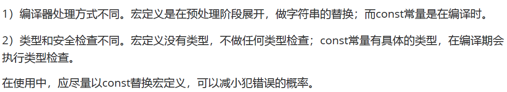

1. 源程序的后缀名 *.cc/*.cpp
2. 编译命令 $ g++ \*.cc/*.cpp [-o name]
3. 安装g++命令 $ sudo apt install g++

# 1 命名空间
## 1.1 为什么用命名空间？
名字冲突就是在同一个作用域中有两个或多个同名的实体，为了解决命名冲突 ，C++中引入了命名空间，所谓命名空间就是一个可以由用户自己定义的作用域，在不同的作用域中可以定义相同名字的变量，互不干扰，系统能够区分它们。

## 1.2 什么是命名空间？
命名空间又称为名字空间，是程序员命名的内存区域，程序员根据需要指定一些有名字的空间域，把一些全局实体分别存放到各个命名空间中，从而与其他全局实体分隔开。
通俗的说，每个名字空间都是一个名字空间域，存放在名字空间域中的全局实体只在本空间域内有效。名字空间对全局实体加以域的限制，从而合理的解决命名冲突。

C++中定义命名空间的基本格式如下：
```c++
namespace wd
{
int val1 = 0;
char val2;
}// end of namespace wd
```
在声明一个命名空间时，大括号内不仅可以存放变量，还可以存放以下类型：
* 变量
* 常量
* 函数，可以是定义或声明
* 结构体
* 类
* 模板
* 命名空间，可以嵌套定义

定义在名称空间中的变量或者函数都称为实体，名称空间中的实体作用域是全局的, 并不意味着其可见域是全局的。
如果不使用作用域限定符和using机制，抛开名称空间嵌套和内部屏蔽的情况，实体的可见域是从实体创建到该名称空间结束。
在名称空间外，该实体是不可见的。

## 1.3 命名空间的使用方式
命名空间一共有三种使用方式，分别是using编译指令、作用域限定符、using声明机制。

### using编译指令
using namespace std
```c++
#include <iostream>
using namespace std;
int main(int argc, char *argv[])
{
    cout << "hell,world" << endl;
    return 0;
}
```
如果一个名称空间中有多个实体，使用using编译指令，就会把该空间中的所有实体一次性引入到程序之中。
如果对一个命名空间中的实体并不熟悉时，直接使用这种方式，有可能还是会造成名字冲突的问题。

### 作用域限定符
std::cout
直接使用作用域限定符::。每次要使用某个名称空间中的实体时，都直接加上。

### using声明机制
using std::cout
using声明机制的作用域是从using语句开始，到using所在的作用域结束。

## 1.4 匿名命名空间
不定义名字的命名空间称为匿名命名空间。由于没有名字，该空间中的实体，其它文件无法引用，它只能在本文件的作用域内有效，它的作用域是从匿名命名空间声明开始到本文件结束。在本文件使用无名命名空间成员时不必用命名空间限定。
在匿名空间中创建的全局变量，具有全局生存期，却只能被本空间内的函数等访问，是static变量的有效替代手段。

## 1.5 命名空间的嵌套及覆盖
```c++
int number = 1;
namespace wd
{
int number = 10;
namespace wh
{
int number = 100;
void display()
{
    cout << "wd::wh::display()" << endl;
}
}//end of namespace wh
void display(int number)
{
    cout << "形参number = " << number << endl;
    cout << "wd命名空间中的number = " << wd::number << endl;
    cout << "wh命名空间中的number = " << wd::wh::number << endl;
}
}//end of namespace wd
int main(void)
{
    using wd::display;
    display();
    return 0;
}
```

## 1.6 对命名空间的思考和总结
下面引用当前流行的名称空间使用指导原则：
* 提倡在已命名的名称空间中定义变量，而不是直接定义外部全局变量或者静态全局变量。
* 如果开发了一个函数库或者类库，提倡将其放在一个名称空间中。
* 对于using 声明，首先将其作用域设置为局部而不是全局
* 不要在头文件中使用using编译指令，这样，使得可用名称变得模糊，容易出现二义性，
* 包含头文件的顺序可能会影响程序的行为，如果非要使用using编译指令，建议放在所有#include预编译指令后。

# 2 const关键字的用法

### 2.1 修饰变量
```c++
const int number1 = 10;//const关键字修饰的变量称为常量
int const number2 = 20;
const int val;//error 常量必须要进行初始化
除了这种方式可以创建常量外，还可以使用宏定义的方式创建常量
#define NUMBER 1024
```

**常考题：const常量与宏定义的区别是什么？**



### 2.2 修饰指针
```c++
//常量指针，Pointer to const
const int * p1 = &number1;
无法用指针修改其所指内容的值

//指针常量，const pointer
int * const p3 = &number1;
不可以改变指针的指向
```

# 3 new/delete表达式
C  malloc/free
C++  new/delete
### 3.1 开辟一个元素的空间
```c++
int *p = new int(1);
cout << *p << endl;
delete p;
```
### 3.2 开辟一个数组的空间
```c++
int *p = new int[10]();//开辟数组时，要记得采用[]
for(int idx = 0; idx != 10; ++idx)
{
    p[idx] = idx;
}
delete []p;//回收时，也要采用[]

```
# 4 引用