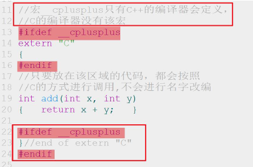

1. 源程序的后缀名 *.cc/*.cpp
2. 编译命令 $ g++ \*.cc/*.cpp [-o name]
3. 安装g++命令 $ sudo apt install g++

# 1 命名空间
## 1.1 为什么用命名空间？
名字冲突就是在同一个作用域中有两个或多个同名的实体，为了解决命名冲突 ，C++中引入了命名空间，所谓命名空间就是一个可以由用户自己定义的作用域，在不同的作用域中可以定义相同名字的变量，互不干扰，系统能够区分它们。

## 1.2 什么是命名空间？
命名空间又称为名字空间，是程序员命名的内存区域，程序员根据需要指定一些有名字的空间域，把一些全局实体分别存放到各个命名空间中，从而与其他全局实体分隔开。
通俗的说，每个名字空间都是一个名字空间域，存放在名字空间域中的全局实体只在本空间域内有效。名字空间对全局实体加以域的限制，从而合理的解决命名冲突。

C++中定义命名空间的基本格式如下：
```c++
namespace wd
{
int val1 = 0;
char val2;
}// end of namespace wd
```
在声明一个命名空间时，大括号内不仅可以存放变量，还可以存放以下类型：
* 变量
* 常量
* 函数，可以是定义或声明
* 结构体
* 类
* 模板
* 命名空间，可以嵌套定义

定义在名称空间中的变量或者函数都称为实体，名称空间中的实体作用域是全局的, 并不意味着其可见域是全局的。
如果不使用作用域限定符和using机制，抛开名称空间嵌套和内部屏蔽的情况，实体的可见域是从实体创建到该名称空间结束。
在名称空间外，该实体是不可见的。

## 1.3 命名空间的使用方式
命名空间一共有三种使用方式，分别是using编译指令、作用域限定符、using声明机制。

### using编译指令
using namespace std
```c++
#include <iostream>
using namespace std;
int main(int argc, char *argv[])
{
    cout << "hell,world" << endl;
    return 0;
}
```
如果一个名称空间中有多个实体，使用using编译指令，就会把该空间中的所有实体一次性引入到程序之中。
如果对一个命名空间中的实体并不熟悉时，直接使用这种方式，有可能还是会造成名字冲突的问题。

### 作用域限定符
std::cout
直接使用作用域限定符::。每次要使用某个名称空间中的实体时，都直接加上。

### using声明机制
using std::cout
using声明机制的作用域是从using语句开始，到using所在的作用域结束。

## 1.4 匿名命名空间
不定义名字的命名空间称为匿名命名空间。由于没有名字，该空间中的实体，其它文件（例如一个.cc就是文件）无法引用，它只能在本文件的作用域内有效，它的作用域是从匿名命名空间声明开始到本文件结束。在本文件使用无名命名空间成员时不必用命名空间限定。
在匿名空间中创建的全局变量，具有全局生存期，却只能被本空间内的函数等访问，是static变量的有效替代手段。

## 1.5 命名空间的嵌套及覆盖
```c++
int number = 1;
namespace wd
{
int number = 10;
namespace wh
{
int number = 100;
void display()
{
    cout << "wd::wh::display()" << endl;
}
}//end of namespace wh
void display(int number)
{
    cout << "形参number = " << number << endl;
    cout << "wd命名空间中的number = " << wd::number << endl;
    cout << "wh命名空间中的number = " << wd::wh::number << endl;
}
}//end of namespace wd
int main(void)
{
    using wd::display;
    display();
    return 0;
}
```

## 1.6 对命名空间的思考和总结
下面引用当前流行的名称空间使用指导原则：
* 提倡在已命名的名称空间中定义变量，而不是直接定义外部全局变量或者静态全局变量。
* 如果开发了一个函数库或者类库，提倡将其放在一个名称空间中。
* 对于using 声明，首先将其作用域设置为局部而不是全局
* 不要在头文件中使用using编译指令，这样，使得可用名称变得模糊，容易出现二义性，
* 包含头文件的顺序可能会影响程序的行为，如果非要使用using编译指令，建议放在所有#include预编译指令后。

# 2 const 关键字

## 2.1 修饰变量
```c++
const int number1 = 10;//const关键字修饰的变量称为常量
int const number2 = 20;
const int val;//error 常量必须要进行初始化
除了这种方式可以创建常量外，还可以使用宏定义的方式创建常量
#define NUMBER 1024
```

**常考题：const常量与宏定义的区别是什么？**


## 2.2 修饰指针
```c++
//常量指针，Pointer to const
const int * p1 = &number1;
无法用指针修改其所指内容的值

//指针常量，const pointer
int * const p3 = &number1;
不可以改变指针的指向
```

# 3 new/delete表达式
申请堆空间
C  malloc/free
C++  new/delete

## 3.1 开辟一个元素的空间
```c++
int *p = new int(1); //初始化了
cout << *p << endl;
delete p;
```

## 3.2 开辟一个数组的空间
[]不要丢！
```c++
int *p = new int[10]();//开辟数组时，要记得采用[]
for(int idx = 0; idx != 10; ++idx)
{
    p[idx] = idx;
}
delete []p;//回收时，也要采用[]
```

## new/delete表达式与malloc/free的区别是？
1. malloc/free是C/C++语言的标准库函数，new/delete是C++的运算符或表达式 ；
2. new能够自动分配空间大小，malloc需要传入参数；
3. new开辟空间的同时还对空间做了初始化的操作，而malloc不行；
4. new/delete能对对象进行构造和析构函数的调用，进而对内存进行更加详细的工作，而malloc/free不能。

## 内存泄漏检测
检测工具valgrind

接下来再执行 $ source .bashrc
memcheck ./a.out

# 4 引用

## 4.1 什么是引用？
变量名实质就是一段连续内存空间的别名
引用是一个已定义变量的别名
类型 &引用名 = 目标变量名；

>1. &在这里不再是取地址符号，而是引用符号，相当于&有第二种用法
>2. 引用的类型必须和其绑定的变量的类型相同
>3. 声明引用的同时，必须对引用进行初始化；否则编译时报错
>4. 一旦绑定到某个变量之后，就不会再改变其指向

## 4.2 引用的本质
引用本质上是一种被限制的指针。所以引用是占据内存的，占据的大小就是一个指针的大小。

## 4.3 引用作为函数参数
当用引用作为函数的参数时，其效果和用指针作为函数参数的效果相当。
```c++
//用指针作为参数
void swap(int *pa, int *pb)
{
    int temp = *pa;
    *pa = *pb;
    *pb = temp;
}
//引用作为参数
void swap(int &x, int &y)
{
    int temp = x;
    x = y;
    y = temp;
}
```

使用指针作为函数的形参虽然达到的效果和使用引用一样，但当调用函数时仍需要为形参指针变量在内存中分配空间，而引用则不需要这样，故在C++中推荐使用引用而非指针作为函数的参数

## 4.4 引用作为函数的返回值
```c++
//语法：
类型 &函数名(形参列表)
{
    //函数体
}
```
当以引用作为函数的返回值时，返回的变量其生命周期一定是要大于函数的生命周期。

当引用作为函数的返回值时，必须遵守以下规则：
1. 不能返回局部变量的引用。
2. 不能在函数内部返回new分配的堆空间变量的引用。容易造成内存泄漏。

## 引用总结
1. 引用的目的主要用于在函数参数传递中，解决大块数据或对象的传递效率和空间不如意的问题。
2. 引用传递函数参数，能保证参数传递中不产生副本，提高传递的效率，且通过const的使用，保证了引用传递的安全性。
3. 引用与指针的区别是，指针指向一个变量后，对所指向的变量间接操作。程序中使用指针，程序的可读性差；而引用本身就是目标变量的别名，对引用的操作就是对目标变量的操作。

# 5 强制转换

c++:
static_cast，const_cast，dynamic_cast，reinterpret_cast

## 5.1 static_cast
最常用的类型转换符，正常状况下的类型转换, 用于将一种数据类型转换成另一种数据类型
```c++
fNumber = (float) iNumber；//C风格
fNumber = static_cast<float>(iNumber);
void *pVoid = malloc(sizeof(int));
int *pInt = static_cast<int*>(pVoid);
```
但不能完成任意两个指针类型间的转换

## 5.2 const_cast
修改类型的const属性。常量指针被转化成非常量指针，并且仍然指向原来的对象；常量引用被转换成非常量引用，并且仍然指向原来的对象；常量对象被转换成非常量对象。
```c++
const int number = 100;
int *pInt = &number;//error
int *pInt2 = const_cast<int *>(&number);
```

## 5.3 dynamic_cast
该运算符主要用于基类和派生类间的转换，尤其是向下转型的用法中。

## 5.4 reinterpret_cast
该运算符可以用来处理无关类型之间的转换，即用在任意指针（或引用）类型之间的转换，以及指针与
足够大的整数类型之间的转换

# 6 函数重载
C++中函数重载是指在同一作用域内，可以有一组具有相同函数名，不同参数列表的函数，这组函数被称为重载函数。

1. 函数名称必须相同 。
2. 参数列表必须不同（参数的类型不同、个数不同、顺序不同）。
3. 函数的返回类型可以相同也可以不相同。
4. 仅仅返回类型不同不足以成为函数的重载。

实现原理：名字改编
查看函数真实名字 nm *.o

## 进行C与C++的混合编程
extern "C" 
{
    //添加的源代码以C的方式调用
}


# 7 默认参数
## 7.1 默认参数的目的
C++可以给函数定义默认参数值。这样调用时，若不给参数传递实参，则f会按指定的默认值进行工作。为了让编程简单，让编译器做更多的检查错误工作。

## 7.2 默认参数的声明
一般默认参数在函数声明中提供。当一个函数既有声明又有定义时，只需要在其中一个中设置默认值即可。

## 7.3 默认参数的顺序规定
默认参数应从右至左逐渐定义。若给某一参数设置了默认值，那么在参数表中其后所有的参数都必须也设置默认值。

## 7.4 默认参数与函数重载
默认参数可将一系列简单的重载函数合成为一个。
如果一组重载函数（可能带有默认参数）都允许相同实参个数的调用，将会引起调用的二义性。

# 8 bool类型
在C++中，还添加了一种基本类型，就是bool类型，用来表示true和false。
true和false是字面值，可以通过转换变为int类型，true为1，false为0

## 9 inline函数
内联函数作为编译器优化手段的一种技术，在降低运行时间上非常有用。

## 9.1 什么是内联函数？
编译器将使用函数的定义体来替代函数调用语句，**发生在编译阶段而非程序运行阶段。**
定义函数时，在函数的最前面以关键字“inline”声明函数，即可使函数称为内联声明函数。
```c++
inline int max(int x, y)
{
    return x > y ? x : y;
}
```

## 9.2 内联函数和带参数的宏定义
宏定义：发生时机预处理，只进行简单的字符串替换，不可调试，无法操作类的私有数据成员
宏定义：发生时机编译时，可调试，操作类的私有数据成员

## 9.3 将内联函数放入头文件
inline **必须与函数定义体放在一起**才能使函数成为内联，仅将 inline 放在函数声明前面不起任何作用。

内联函数应该在头文件中定义，当然内联函数定义也可以放在源文件中，但此时只有定义的那个源文件可以用它。

## 9.4 谨慎地使用内联
以下情况不宜使用内联：
* 函数体内代码比较长
* 函数体中出现循环或其他复杂的控制结构

# 10 异常安全
异常是程序在执行期间产生的问题。C++ 异常是指在程序运行时发生的特殊情况，比如尝试除以零的操作。异常提供了一种转移程序控制权的方式。C++ 异常处理涉及到三个关键字：try、catch、throw。

* throw: 当问题出现时，程序会抛出一个异常。通过使用 throw 关键字来完成的。
* try: try 块中的代码标识将被激活的特定异常，它后面通常跟着一个或多个 catch 块。
* catch: 在您想要处理问题的地方，通过异常处理程序捕获异常。catch 关键字用于捕获异常。

## throw 表达式

## try-catch 语句块