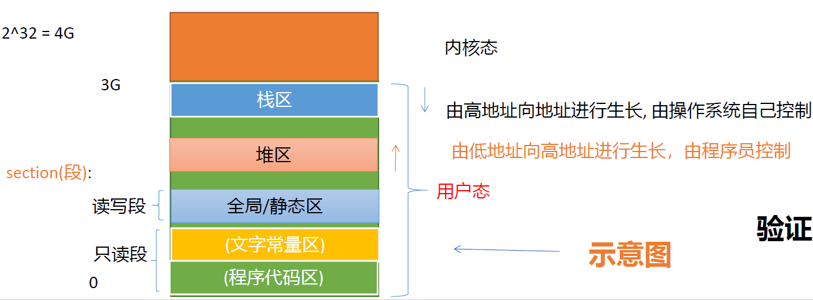

# 程序内存布局
Linux默认将高地址的1G空间分配给内核，用户使用剩下的3G空间成为用户态空间，用户态空间一般有如下默认区域：
1. 栈区(stack)：由编译器自动分配释放，存放函数的参数值，局部变量的值等。
其操作方式类似于数据结构中的栈。
2. 堆区(heap)：一般由程序员分配释放，若程序员不释放，程序结束时可能由OS回收。注意它与数据结构中的堆是两回事，分配方式类似于链表。
3. 全局/静态区(static)：全局变量和静态变量的存储是放在一块的，在程序编译
时分配。
4. 文字常量区：存放常量字符串。
5. 程序代码区：存放函数体（类的成员函数、全局函数）的二进制代码

# 栈与堆的比较
## 申请后系统的响应
* 栈：只要栈的剩余空间大于所申请空间，系统将为程序提供内存，否则将报异常提示栈溢出。
* 堆：首先应该知道操作系统有一个记录空闲内存地址的链表，当系统收到程序
的申请时，会遍历该链表，寻找第一个空间大于所申请空间的堆结点，然后将
该结点从空闲结点链表中删除，并将该结点的空间分配给程序。

## 申请效率的比较
* 栈由系统自动分配，速度较快。但程序员无法控制。
* 堆是由new分配的内存，一般速度比较慢，而且容易产生内存碎片,不过用起来最方便。

## 申请大小的限制
* 栈：栈顶的地址和栈的最大容量是系统预先规定好的。
* 堆：受限于计算机系统中有效的虚拟内存较灵活

## 堆和栈中的存储内容

# 栈与堆的区别
1. 管理方式不同。对于栈来讲，是由编译器自动管理，无需我们手工控制；对于
堆来说，释放工作由程序员控制，容易产生memory leak.
2. 空间大小不同。一般来讲在32位系统下，内存可以达到4G的空间，从这个角度来看堆内存几乎是没有什么限制的。但是对于栈来讲，一般都是有一定的空间大小的，例如，在VS下，默认的栈空间大小是1M
3. 分配方式。内存有2种分配方式：静态分配和动态分配。堆都是动态分配的，没有静态分配的堆。静态分配是编译器完成的，比如局部变量的分配。动态分配由malloc, calloc函数进行分配，但是栈的动态分配和堆是不同的，他的动态分
配是由编译器进行释放，无需我们手工实现。
4. 生长方向。对于堆来讲，生长方向是向上的，也就是向着内存地址增加的方
向；对于栈来讲，它的生长方向是向下的，是向着内存地址减小的方向增长。
5. 碎片问题。对于堆来讲，频繁的new/delete势必会造成内存空间的不连续，从而造成大量的碎片，使程序效率降低。对于栈来讲，则不会存在这个问题，因为栈是先进后出的，他们是如此的一一对应，以至于永远都不可能有一个内存块从栈中间弹出，在他弹出之前，在它上面的后进的栈内容已经被弹出。
6. 生长方向。对于堆来讲，生长方向是向上的，也就是向着内存地址增加的方向；对于栈来讲，它的生长方向是向下的，是向着内存地址减小的方向增长。