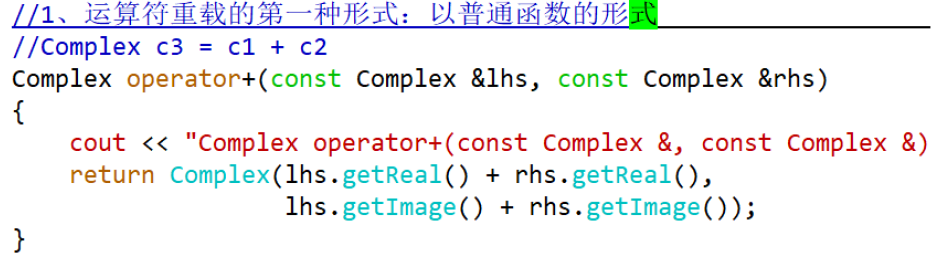
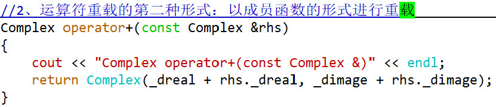
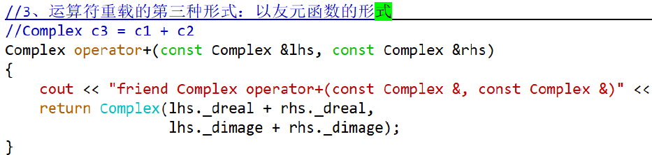
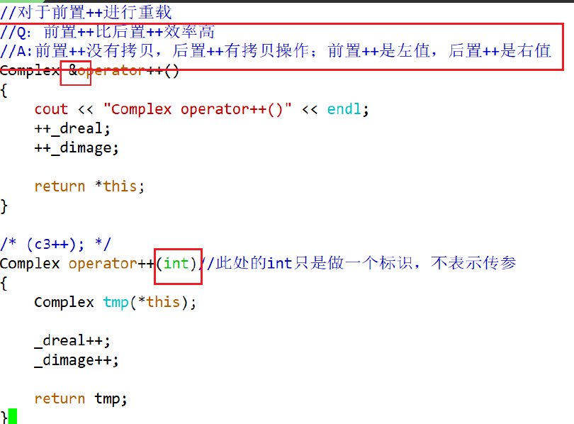

# 运算符重载
# 1. 友元
一般来说，类的私有成员只能在类的内部访问，类之外是不能访问它们的。但如果将其他类或函数设置为类的友元（friend），就可以访问了。

## 1.1 形式
友元的形式可以分为友元函数和友元类。
```c++
class 类名
{
//...
friend 函数原型;
friend class 类名;
//...
}
```

## 1.2 友元的三种使用形式
* 友元之普通函数的形式
* 友元之成员函数
显示调用构造函数会创建对象,创建对象的时候会调用构造函数
* 友元之友元类
一个类A的所有成员函数都是另外一个类B的友元，可以将A设置为B的友元

## 1.3 友元的特点
友元是单向的，友元不具有传递性（A->B->C）,友元关系不能被继承
友元的声明是不受public/protected/private关键字限制的

# 2. 运算符重载
需要对自定义类型进行运算，这个时候就需要对运算符进行重新定义，赋予其新的功能
运算符重载的实质就是函数重载或函数多态。

## 2.1 重载框架
```c++
返回类型 operator 运算符(参数表)
{
//...
}
```
## 2.2 运算符重载规则
不能重载的五种运算符：
1. 成员访问符.
2. 成员指针运算符.*
3. 条件运算符?:
4. 域运算符::
5. 长度运算符sizeof

* 重载的运算符的操作对象至少有一个是自定义类型或枚举类型
* 优先级和结合性固定不变。
* 不会改变运算符的用法，原来有几个操作数、操作数在左边还是在右边，这些都不会改变。
* 重载运算符函数不能有默认参数，否则就改变了运算符操作数的个数。
* 重载逻辑运算符（&&,||）后不再具备短路求值特性。
* 不能臆造一个并不存在的运算符，如@、$等

## 2.3 运算符重载的形式
运算符重载的形式有三种：
* 采用普通函数的重载形式
* 采用成员函数的重载形式
* 采用友元函数的重载形式

1. 以普通函数的形式

2. 以成员函数的形式

3. 友元函数的形式


# 3. 特殊运算符的重载
## 3.1 复合赋值运算符
复合赋值运算符推荐以成员函数的形式进行重载，包括这些(+=,-=,*=,／=,%=,<<=,>>=,&=,^=,|=)。因为对象本身会发生变化。

## 3.2 自增自减运算符


## 3.3 赋值运算符
对于赋值运算符=，只能以成员函数形式进行重载

## 3.4 函数调用运算符
函数调用运算符的重载形式只能是成员函数形式，其形式为:
```c++
返回类型 类名::operator()(参数列表)
{
//...
}
```
一个类如果重载了函数调用operator()，就可以将该类对象作为一个函数使用。对于这种重载了函数调用运算符的类创建的对象，我们称为函数对象（Function Object）。

## 3.5 下标访问运算符
下标访问运算符[ ]通常用于访问数组元素，它是一个二元运算符。对下标访问运算符进行重载时，只能以成员函数形式进行，如果从函数的观点来看，语句arr[idx];可以解释为arr.operator[](idx);

## 3.6 成员访问运算符
成员访问运算符包括箭头访问运算符->和解引用运算符*

## 3.7 输入输出流运算符
由于非静态成员函数的第一个参数是隐含的this指针，代表当前对象本身，这与其要求是冲突的，因此>>和<<不能重载为成员函数，只能是非成员函数

# 4. 类型转换
* 由其他类型向自定义类型转换
* 由自定义类型向其他类型转换

## 4.1 由其他类型向自定义类型转换
由其他类型向定义类型转换是由构造函数来实现的，只有当类中定义了合适的构造函数时，转换才能通过。这种转换，一般称为隐式转换。
禁止隐式转换:在相应构造函数前面加上explicit关键字。

## 4.2 由自定义类型向其他类型转换
由自定义类型向其他类型的转换是由类型转换函数完成的，这是一个特殊的成员函数。
