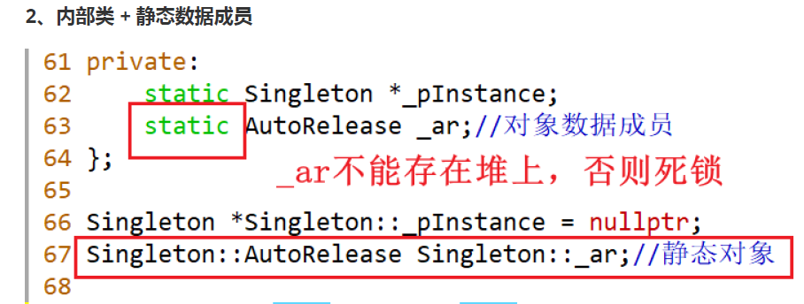
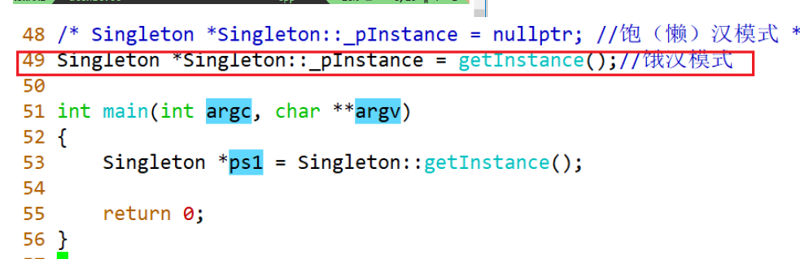

# 类域
作用域可以分为类作用域、类名的作用域以及对象的作用域几部分内容。
# 1. 全局作用域
在函数和其他类定义的外部定义的类称为全局类中，全局类具有全局作用域。

# 2. 类作用域
一个类可以定义在另一类的定义中，这是所谓嵌套类或者内部类

## 2.1 设计模式之Pimpl
PIMPL（Private Implementation 或Pointer to Implementation）是通过一个私有的成员指针，将指针所指向的类的内部实现数据进行隐藏。PIMPL又称作“编译防火墙”，它的实现中就用到了嵌套类。
设计模式有如下优点：
1. 提高编译速度；
2. 实现信息隐藏；
3. 减小编译依赖，可以用最小的代价平滑的升级库文件；
4. 接口与实现进行解耦；
5. 移动语义友好。

## 2.2 单例模式的自动释放
检测内存泄漏的工具valgrind

### 使用友元形式进行设计
将单例模式的内存释放放到友元函数的析构函数里。

### 内部类加静态数据成员形式

内部类里实现释放，内部作为静态数据成员

### atexit方式进行
atexit()注册释放函数，当进程正常结束时，注册的函数会被执行，注册几次就执行几次。

饿汉模式保证多线程下的安全

### pthread_once 形式

# 3. 块作用域
类的定义在代码块中，这是所谓局部类，该类完全被块包含，其作用域仅仅限于定义所在块，不能在块外使用类名声明该类的对象。