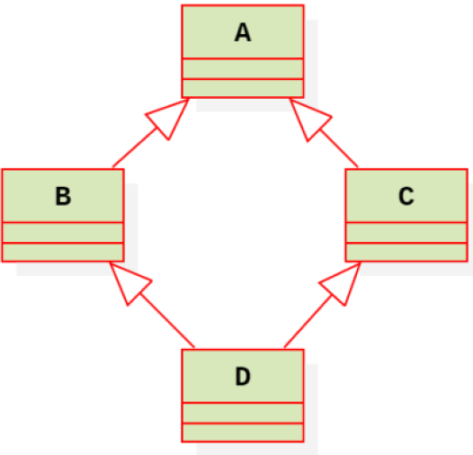

# 继承

# 1. 继承的定义
类派生列表的形式是在类名之后，大括号之前用冒号分隔，后面紧跟以逗号分隔的基类列表，其中每个基类前面可以有访问修饰限定符
```c++
class 派生类
: public/protected/private 基类
{
};
```
派生类的生成过程包含3个步骤:
1. 吸收基类的成员
2. 改造基类的成员
3. 添加自己新的成员

# 2. 继承的局限
不论何种继承方式，下面这些基类的特征是不能从基类继承下来的：
* 构造函数
* 析构函数
* 用户重载的operator new/delete运算符
* 用户重载的operator=运算符
* 友元关系

# 3. 派生方式对基类成员的访问权限
派生类继承了基类的全部成员变量和成员方法（除了构造和析构之外的成员方法）。
1. 不管以什么继承方式，派生类内部都不能访问基类的私有成员。
2. 不管以什么继承方式，派生类内部除了基类的私有成员不可以访问外，其他的都可以访问。
3. 不管以什么继承方式，派生类对象除了公有继承基类中的公有成员可以访问外，其他的一律不能访问

# 4. 派生类对象的构造
创建派生类对象时，系统首先通过派生类的构造函数来调用基类的构造函数，完成基类成员的初始化，而后对派生类中新增的成员进行初始化。
```c++
派生类名(总参数表)
: 基类构造函数(参数表)
{
//函数体
};
```
必须将基类构造函数放在派生类构造函数的初试化列表中，以调用基类构造函数完成基类数据成员的初始化
调用顺序为：
1. 分配空间，由系统在调用构造函数时自动完成。
2. 调用基类的构造函数完成基类成员的初始化。
3. 若派生类中含对象成员、const成员或引用成员，则必须在初始化表中完成其初始化。
4. 派生类构造函数体执行。

# 5. 派生类对象的销毁
在执行派生类析构函数时，**基类析构函数会被自动调用。**
先执行派生类的析构函数，再执行基类的析构函数，这和执行构造函数时的顺序正好相反。
1. 先调用派生类的析构函数
2. 再调用派生类中成员对象的析构函数
3. 最后调用普通基类的析构函数

# 6. 多基继承（多基派生）
```c++
class 派生类
: public/protected/private 基类1
, ...
, public/protected/private 基类N
{
};
```
## 6.1 多基继承的派生类对象的构造和销毁
```c++
派生类名(总参数表)
: 基类名1(参数表1)
, 基类名2(参数表2)
, ...
, 基类名N(参数表N)
{
//函数体
}
```
首先要执行所有基类的构造函数，再执行派生类构造函数中初始化表达式的其他内容和构造函数体。
各基类构造函数的执行顺序与其在初始化表中的顺序无关，而是由**定义派生类时指定的基类继承顺序**决定的。

## 6.2 成员名冲突的二义性
使用作用域限定符就可以解决该问题。
d.A::print()
d.B::print()

## 6.3 菱形继承的二义性问题

解决方案是采用虚拟继承。
virtual public/protected/private 基类名

# 7. 基类与派生类间的相互转换
派生类适应于基类
* 可以把派生类的对象赋值给基类的对象
* 可以把基类的引用绑定到派生类的对象
* 可以声明基类的指针指向派生类的对象 (向上转型)

如果函数的形参是基类对象或者基类对象的引用或者基类对象的指针类型，在进行函数调用时，相应的实参可以是派生类对象。

# 8. 派生类对象间的复制控制
1. 如果定义了基类的拷贝构造函数，没有定义派生类的拷贝构造函数，派生类部分执行缺省的行为，基类部分执行用户定义的基类拷贝构造函数。
2. 如果重载了基类的赋值运算符函数，派生类部分执行缺省的赋值行为，基类部分执行用户定义的重载赋值函数。
3. 如果定义了派生类的拷贝构造函数或者重载了派生类的对象赋值运算符=，将会执行用户定义的派生类的拷贝构造函数或者重载赋值函数，而不会再自动调用基类的拷贝构造函数和基类的重载对象赋值运算符，这时，通常需要用户在派生类的拷贝构造函数或者派生类的赋值函数中显式调用基类的拷贝构造或赋值运算符函数。