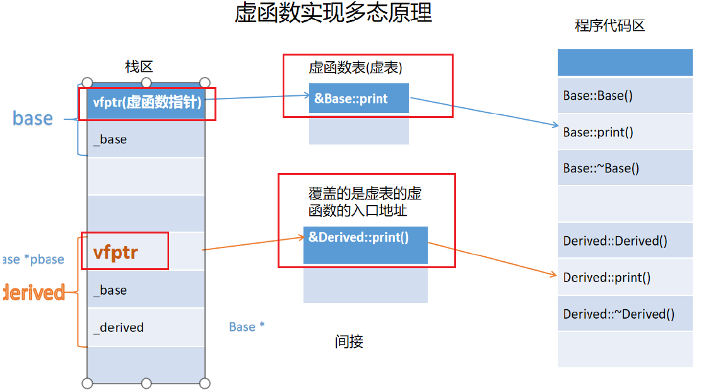
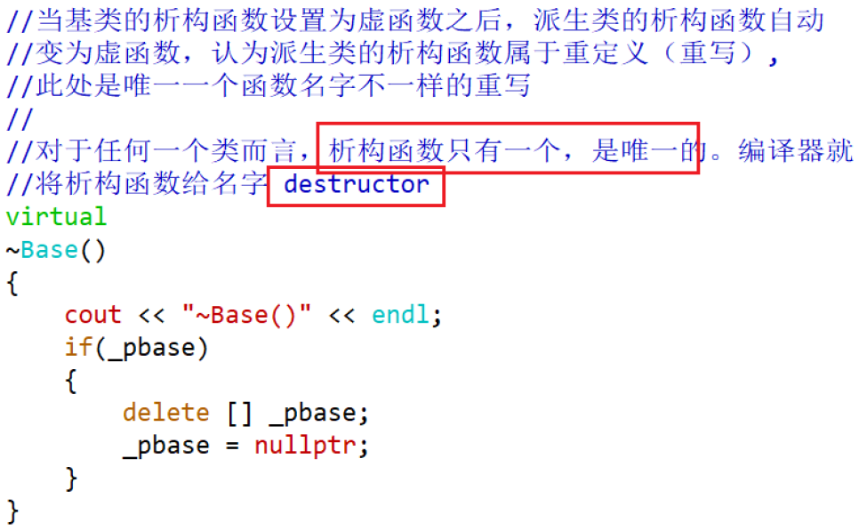

# 多态
C++支持两种多态性：编译时多态和运行时多态。
编译时多态(静态多态)：函数重载、运算符重载、模板
运行时多态(动态多态)：虚函数

# 1. 虚函数的定义
在成员函数的前面加上virtual的函数称为虚函数。
```c++
class A
{
public:
virtual void print(int x, double y)
{}
};
class B
: public A
{
virtual void print(int x, double y)
{}
};
```
基类的虚函数在所有派生类中也为虚函数，即使在派生类中省略了virtual关键字，也仍然是虚函数。
派生类**重定义**虚函数格式：
1. 函数名字要相同
2. 函数的参数列表要完全相同（参数的个数、参数的类型、参数顺序）
3. 函数的返回类型必须相同

总结：除了函数的函数体可以不一样之外，其他的都必须一样

# 2. 虚函数的实现机制
动态多态的原理:
通过一张虚函数表实现。
当类中定义了一个虚函数后，会在该类对象的存储布局的开始位置多一个虚函数指针（vfptr），该虚函数指针指向了一张虚函数表，而该虚函数表就像一个数组，表中存放的就是各虚函数的入口地址。

当一个基类中有虚函数，而一个派生类继承了该基类，并对虚函数进行了重定义，称之为覆盖(override). 这里的覆盖指的是派生类的虚函数表中相应虚函数的入口地址被覆盖。

**虚函数激活条件：**
1. 基类定义虚函数
2. 派生类重定义（覆盖、重写）虚函数
3. 创建派生类对象
4. 基类的指针(引用)指向(绑定)派生类对象
5. 基类指针(引用)调用虚函数

# 3. 哪些函数不能被设置为虚函数？
1. 普通函数（非成员函数）：虚函数必须是一个成员函数；
2. 静态成员函数：静态函数发生在编译时，虚函数体现多态发生在运行时。静态成员函数没有this；
3. 内联成员函数：内联函数在编译时被展开，而虚函数在运行时才动态绑定。
4. 构造函数：发生时间在编译时，而虚函数在运行时；从继承角度看，构造函数不能被继承，而虚函数是可以被继承的。
5. 友元函数：友元函数本身是成员函数的时候是可以设置为虚函数的。

# 4. 虚函数的访问
## 4.1 指针访问
使用指针访问虚函数时，根据指针所指对象的类型决定调用函数(动态联编)，与指针本身的类型无关。可以体现出多态。
## 4.2 引用访问
与使用指针访问虚函数类似，表现出动态多态特性。引用一经声明后，引用变量本身无论如何改变，其调用的函数就不会再改变，始终指向其开始定义时的函数。
## 4.3 对象访问
调用哪个类的函数取决于定义对象名的类型。没有体现多态
## 4.4 成员函数中访问
在类内的成员函数中访问该类层次中的虚函数，采用动态联编，要使用this指针。可以体现动态多态。
## 4.5 构造函数和析构函数中访问
构造函数和析构函数是特殊的成员函数，在其中访问虚函数时，C++采用静态联编。没有体现多态。

# 5. 纯虚函数
声明纯虚函数的目的在于，提供一个与派生类一致的接口。
```c++
class 类名
{
public:
virtual 返回类型 函数名(参数) = 0;
};
```

# 6. 抽象类
只要类中含有一个纯虚函数，该类便为抽象类。

* 一个类可以包含多个纯虚函数。
* 抽象类只能作为基类来派生新类，不能创建抽象类的对象。
* 如果派生类没有对所有的纯虚函数进行重定义，则该派生类也为抽象类。

另外一种形式的抽象类:只定义了protected型的构造函数而没有提供public构造函数

# 7. 虚析构函数
一般来说，如果类中定义了虚函数，析构函数也应被定义为虚析构函数，尤其是类内有申请的动态内存，需要清理和释放的时候。 
如果基类的析构函数为虚函数的，派生类的析构函数也将自动成为虚析构函数，无论派生类析构函数声明中是否加virtual关键字。


# 8. 重载、隐藏、覆盖
* 重载：在同一个作用域中，函数名称相同，但参数的类型、个数、顺序不同（参数列表不一样）。
* 覆盖(重写)：在基类与派生类中，同名虚函数，参数列表亦完全相同。
* 隐藏：在基类与派生类中，派生类的函数屏蔽了基类中的同名函数。同名数据成员也有隐藏。

# 9. 测试虚表的存在
