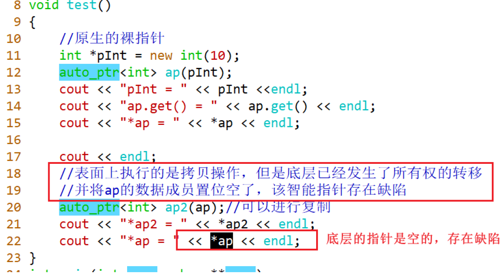

# 1. 资源管理
## RAII本质
利用对象的生命周期管理,因为对象在离开作用域的时候，会自动调用析构函数。
关键：要保证资源的释放顺序与获取顺序严格相反。正好是析构函数与构造函数的作用。

## RAII特征
1. 在构造函数初始化资源，或者托管资源。
2. 析构函数释放资源。
3. 一般不允许复制或者赋值(对象语义)
将拷贝构造函数和赋值运算符函数设置为私有
将拷贝构造函数和赋值运算符函数使用=delete
4. 提供若干访问资源的方法。

值语义：可以进行复制与赋值
对象语义：不能进行复制与赋值

# 2. 智能指针
## auto_ptr
最简单的智能指针，使用上存在缺陷，所以被弃用。(C++17已经将其删除了)
表面上执行拷贝构造函数,但是在底层已经发生了所有权(资源的)的转移

## unique_ptr
1. 在语法层面不允许复制或者赋值
2. 具有移动语义（具有移动构造函数与移动赋值函数），可以作为容器的元素

## shared_ptr
使用引用技术统计指向同一块空间的shared_ptr对象的个数
1. 可以进行复制或者赋值
2. 具有移动语义，可以作为容器的元素
3. 循环引用(缺陷)
可能造成内存泄漏
解决循环引用的办法是使得其中一个改为weak_ptr，不会增加引用计数

## weak_ptr
弱引用,不会引用计数增加.
不能直接托管裸指针，只能从shared_ptr去进行复制或者赋值，或者从其他的weak_ptr复制或者赋值。
判断weak_ptr托管的资源还存在与否，可以使用lock函数或者expired函数。

## 删除器
库中实现的各种智能指针，默认是用delete来释放空间。
若采用malloc申请的空间或是用fopen打开的文件，这时智能指针就无法来处理，因此需要为智能指针定制删除器，提供一个可以自由选择析构的接口，这样智能指针就可以处理不同形式开辟的空间以及可以管理文件指针。

自定义智能指针的方式有两种，函数指针与仿函数(函数对象)
unique_ptr(存在于模板的第二个参数)
shared_ptr(存在于构造函数之中)。